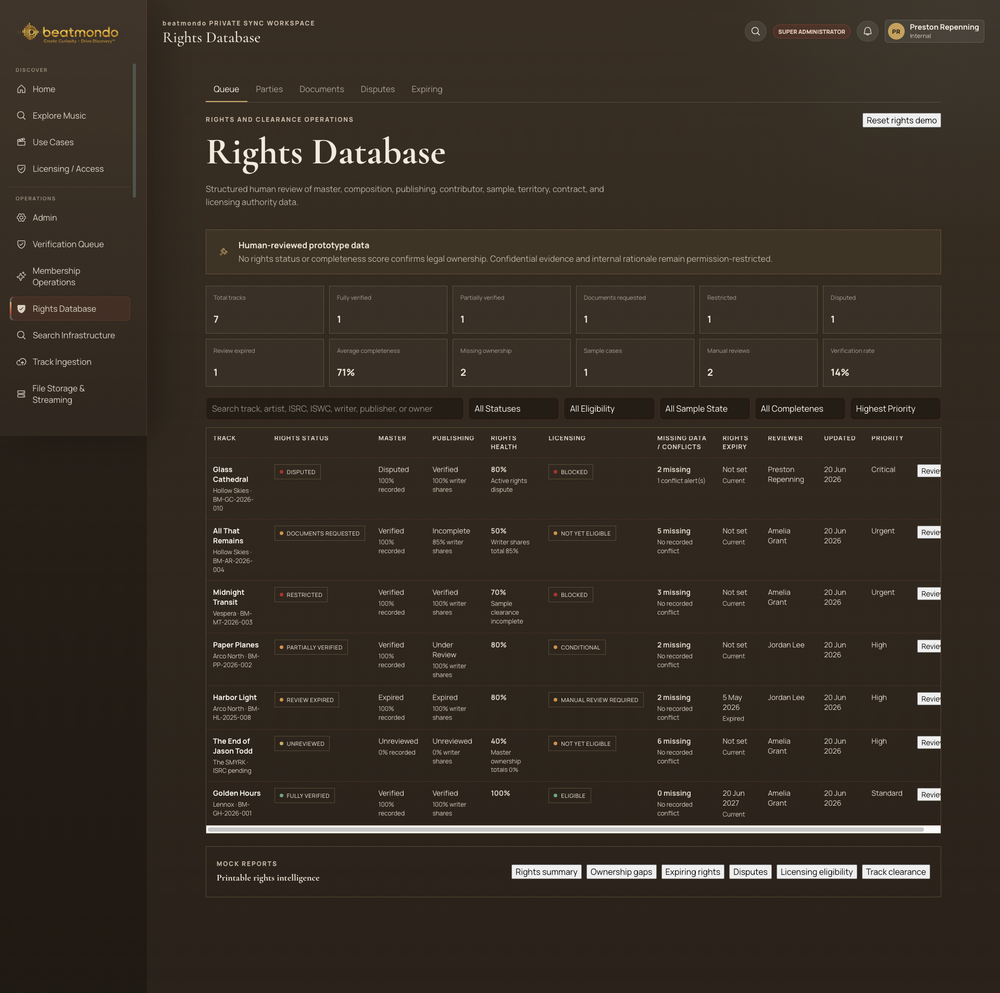

# Rights Database Queue — Screen Audit

## Audit scope

- Surface: internal Rights Database, Queue tab
- User goal: identify the highest-risk rights records and move a track into review quickly
- Evidence: one supplied desktop screenshot at 1920 × 1908
- Health: Needs improvement; the core data model is strong, but readability, action clarity, and table scalability weaken the operational workflow.

## Strengths

- The screen separates rights status, licensing eligibility, conflicts, expiry, reviewer, and priority instead of collapsing them into one state.
- The human-review notice sets an appropriately cautious legal expectation.
- The queue is visibly sorted by priority and uses textual status labels in addition to color.
- Navigation and active-page state are easy to locate.

## Highest-impact issues and enhancements

1. **Critical — The table clips its primary row action.** The rightmost Review buttons are cut off and a horizontal scrollbar is visible. Keep Track and Review sticky, allow middle columns to scroll, and provide a column-density or column-visibility control.
2. **High — Text is too small and low-contrast for sustained operational work.** KPI labels, table metadata, status chips, and secondary copy are difficult to read against the dark brown background. Increase base table text, strengthen muted text contrast, and validate contrast at normal and zoomed sizes.
3. **High — The 12 KPI cards create equal visual weight without a clear operational story.** Prioritize a smaller first row for Blocked/Disputed, Expiring, Missing Ownership, and Awaiting Documents. Move secondary completeness and volume metrics into a collapsible summary.
4. **High — Native white buttons break the design system.** Reset rights demo, Review, and report actions look like unstyled browser controls. Replace them with the existing dark luxury button patterns, clear hover/focus states, and a consistent hierarchy.
5. **High — Reset rights demo is too prominent and too ambiguous.** It sits beside the page heading without explaining impact. Move it into a demo/settings menu, label it “Reset demo data,” and require a confirmation with a concise description of what will reset.
6. **High — Filters are cramped and lack workflow feedback.** Add a result count, visible active-filter chips, Clear filters, and consistent control widths. Use labels or accessible names beyond placeholder-only search text.
7. **High — The queue lacks work-management actions.** Add selection, bulk assign, request documents, set review due date, and escalate/flag actions. Rights teams need to manage work, not only open records one by one.
8. **Medium — Status concepts are accurate but hard to interpret quickly.** Rights Status, Rights Health, and Licensing can produce combinations such as Disputed + 80% + Blocked. Add concise explanations/tooltips and a legend so completeness is not mistaken for legal clearance.
9. **Medium — Some state labels are internally confusing.** “Not set / Current” under Rights Expiry can read as contradictory. Use distinct values such as No expiry supplied, Not applicable, Active through [date], or Expired.
10. **Medium — The table repeats supporting details and wraps excessively.** Values such as “100% recorded” and writer-share notes create visual noise. Lead with the exception and reveal evidence details in the row expansion or review drawer.
11. **Medium — The information hierarchy repeats the page title and leaves too much pre-table space.** The small top “Rights Database” label and large heading duplicate one another. Tighten the header and bring priority work closer to the first viewport.
12. **Medium — Tabs have weak active and click affordance.** Increase tab target height, strengthen the active state beyond a thin underline, and show counts where useful (for example, Disputes 1 and Expiring 1).
13. **Medium — Report actions are visually disconnected from the queue.** Group them under an Export reports menu or a clearly labelled report panel with format/state feedback. Six equal buttons are hard to scan.
14. **Medium — The screen is not ready for larger datasets.** Add pagination or virtualized rows, total/filtered count, sticky headers, saved views, and a clear default sort indicator.
15. **Accessibility risk — Color and tiny uppercase labels carry too much meaning.** Text labels help, but red/amber/green dots and thin borders remain difficult to distinguish. Use stronger text/state icons and do not rely on hue alone.
16. **Accessibility risk — Focus, keyboard behavior, semantics, and zoom reflow cannot be confirmed from the screenshot.** Verify visible focus on tabs, filters, row actions, and the horizontal-scroll region; test reading order, table headers, status announcements, 200% zoom, and keyboard-only review access.

## Recommended sequence

1. Fix table clipping and standardize all actions.
2. Increase typography/contrast and reduce KPI overload.
3. Improve filters, state explanations, and operational bulk actions.
4. Test keyboard, screen-reader table semantics, and 200% zoom/reflow.

## Evidence limits

This is a screenshot-only audit of one desktop state. It cannot confirm interaction behavior, responsive layouts, hover/focus states, screen-reader output, keyboard order, loading/error/empty states, or whether the displayed controls are functional.
